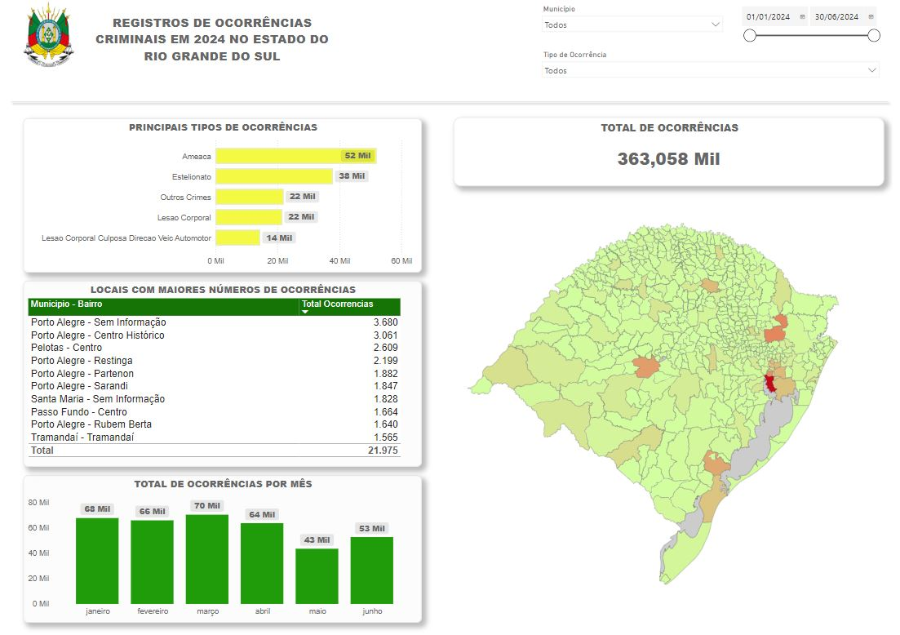

:small_blue_diamond: 🇵🇹
# :small_blue_diamond: **Registros de Ocorrências Criminais - Estado do Rio Grande do Sul/Brasil**

Este projeto tem como objetivo realizar uma análise descritiva dos registros de ocorrências criminais no ano de **2024 (janeiro a junho)**, no estado do **Rio Grande do Sul/Brasil**.

---

## 📋 **Objetivo do Projeto**

- Analisar descritivamente os registros de ocorrências criminais de janeiro a junho de 2024 no estado do Rio Grande do Sul.

---

## 📊 **Fonte de Dados**

Os dados utilizados são públicos e foram disponibilizados pela **Secretaria da Segurança Pública do Estado do Rio Grande do Sul**.

📁 **Link para acesso à base de dados**: [Clique aqui](https://ssp.rs.gov.br/dados-abertos)

💻 **A primeira etapa de edição e limpeza dos dados foi realizada com a linguagem de programação Python utilizando o Google Colab.**

---

## 📊 **Dashboard**

A ferramenta **Microsoft Power BI** foi utilizada para:

- **Limpeza e tratamento dos dados.**
- **Construção do dashboard interativo.**

### 📌 **O Dashboard Responde:**

- Total de ocorrências.
- Principais tipos de ocorrências.
- Locais (Município - Bairro) com os maiores números de ocorrências.
- Total de ocorrências por mês.

Além disso, é possível filtrar as informações específicas por **Município**, **Tipo de Ocorrência** e **Data do Registro**.

---

### 📊 **Link para o Dashboard**

:bar_chart: Acesse o dashboard interativo clicando no link abaixo:

[**Acesse o Dashboard**](https://app.powerbi.com/view?r=eyJrIjoiMzdjNTVlZDctNTk1ZS00YjBjLWFiYmMtODIzNTBjMTYwMjdhIiwidCI6IjA3M2ZmOGM0LWExZDEtNDNiYi1iODNmLWQyNTQ0YmMzODZiMCIsImMiOjh9)

---

## 🖼️ **Prévia do Dashboard**

  

---

🔹 🔹 🔹 🔹 🔹 🔹 🔹 🔹 🔹 🔹 🔹 🔹 🔹 🔹 🔹 🔹 🔹 🔹 🔹 🔹 🔹 🔹 🔹 🔹 🔹 🔹 🔹 🔹 🔹 🔹 🔹 🔹 🔹 🔹 🔹 🔹

# :small_blue_diamond: **Criminal Records - State of Rio Grande do Sul/Brazil**

This project aims to perform a descriptive analysis of criminal records for the year **2024 (January to June)** in the state of **Rio Grande do Sul/Brazil**.

---

## 📋 **Project Objective**

- Descriptively analyze criminal records from January to June 2024 in the state of Rio Grande do Sul.

---

## 📊 **Data Source**

The data used is public and was provided by the **Public Security Secretariat of the State of Rio Grande do Sul**.

📁 **Link to access the database**: [Click here](https://ssp.rs.gov.br/dados-abertos)

💻 **The first stage of data editing and cleaning was performed using the Python programming language in Google Colab.**

---

## 📊 **Dashboard**

The **Microsoft Power BI** tool was used to:

- **Clean and process the data.**
- **Build the interactive dashboard.**

### 📌 **The Dashboard Answers:**

- Total number of occurrences.
- Main types of occurrences.
- Locations (Municipality - Neighborhood) with the highest number of occurrences.
- Total number of occurrences per month.

Additionally, it is possible to filter specific information by **Municipality**, **Type of Occurrence**, and **Date of Registration**.

---

### 📊 **Link to the Dashboard**

:bar_chart: Access the interactive dashboard by clicking the link below:

[**Access the Dashboard**](https://app.powerbi.com/view?r=eyJrIjoiMzdjNTVlZDctNTk1ZS00YjBjLWFiYmMtODIzNTBjMTYwMjdhIiwidCI6IjA3M2ZmOGM0LWExZDEtNDNiYi1iODNmLWQyNTQ0YmMzODZiMCIsImMiOjh9)

---

## 🖼️ **Dashboard Preview**

  

